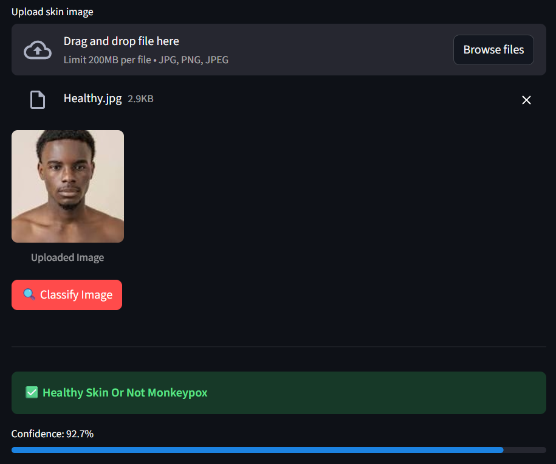
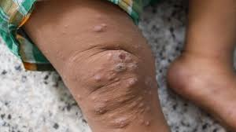
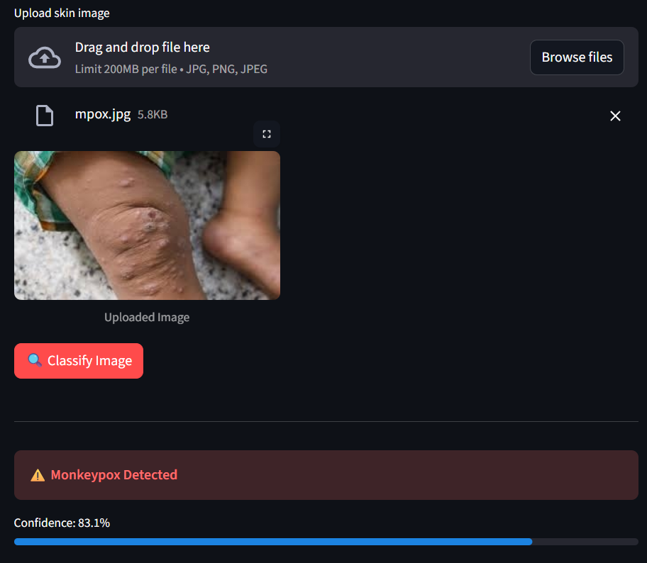

# Monkeypox Disease Detection with ResNet152

### Overview
This project focuses on detecting Monkeypox skin disease from images using a ResNet152 deep learning model. The model is trained on labeled images from Monkeypox and Healthy classes and achieves high accuracy with reliable performance and no overfitting.
  

### Tech Stack
`Python` | `tensorflow` | `sklearn` | `numpy` | `matplotlib` | `PIL`|

### Repository Structure
Monkeypox Disease Detection with ResNet152  
    ├── inference/ → images used for inference  
    ├── Model/ → model best weigths  
    ├── notebooks/ → data prep, training, and inference  
    ├── results/ → outputs, plots, or images   
    ├── README.md  
    └── requirements.txt  

### 📊 Results
Below are sample outputs from the trained YOLOv5 model detecting drones in test images:

| Input Image | Detection Result |
|--------------|------------------|
|  |  |
|  |  |

**Final Training Metrics:**
- accuracy: 0.8783 - loss: 0.2806
- val_accuracy: 0.8432 - val_loss: 0.3422 
- Precision: 0.9022
- Recall: 0.8796
- F1-Score: 0.8908


### To use it without downloading the repo go to:
  ```bash
  https://monkeypox-disease-detection-with-resnet152-kxcrrtwp5ch7oersgif.streamlit.app/
  ```

### How to Run

1. **Clone the repository**

  ```bash
  git clone https://github.com/beshoyhakeem/Monkeypox-Disease-Detection-with-ResNet152.git
  cd /Monkeypox-Disease-Detection-with-ResNet152
  ```

2. **Install dependencies**

  ```bash
  pip install -r requirements.txt
   ```

3. **Run the streamlit app**
 
  ```bash
streamlit run app.py
```


### Future Improvments
1. **Using Multiply Skin Disease Classes**
2. **Adding more data and improve its Quality**
2. **Using instance segmentation**


### 👤 Author
**Beshoy Hakeem**  
[LinkedIn](https://www.linkedin.com/in/beshoy-fahmy-14a254359/)  
[GITHUB](https://github.com/beshoyhakeem)  
Email: beshoyashraf042@gmail.com  
